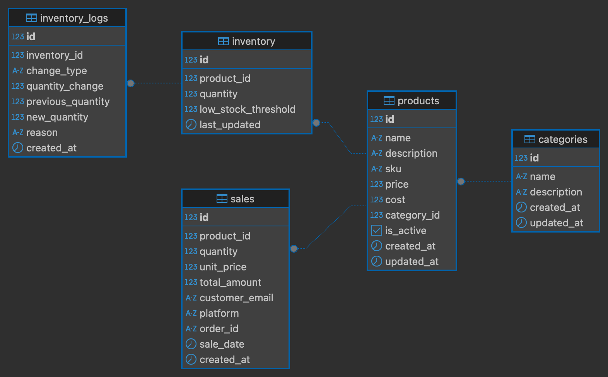

# E-commerce Admin API

## Overview
A RESTful API built with FastAPI and PostgreSQL for the e-commerce admin dashboard, providing features like sales analytics and inventory management.

## Technology Stack
- **Backend Framework**: Python with FastAPI
- **Database**: PostgreSQL with indexing
- **API Architecture**: RESTful APIs
- **Containerization**: Docker Compose for easy deployment

## Setup Instructions
```bash
git clone https://github.com/osamanadeem9/ecommerce-api
cd ecommerce-api
docker-compose up -d --build
```

## Key Features
- **Sales Analytics**: Daily, weekly, monthly, and annual revenue analysis with period comparisons
- **Inventory Management**: Real-time inventory tracking with low stock alerts
- **Product Registration**: Full CRUD operations for product management
- **Data Filtering**: Advanced filtering by date range, product, category, and platform
- **Performance Optimized**: Database indexing for efficient queries

## API Endpoints

### Sales Analytics
- `GET /sales/analytics?period=daily|weekly|monthly|annual` - Sales analytics for current periods
- `GET /sales/revenue-comparison?period=daily|weekly|monthly|annual` - Revenue period comparisons
- `GET /sales/?platform=Walmart&start_date=2024-01-01&end_date=2024-12-31` - Filter sales data
- `POST /sales/` - Create new sale record

### Inventory Management
- `GET /inventory/` - View current inventory status
- `GET /inventory/low-stock` - Low stock alerts
- `PUT /inventory/{id}` - Update inventory levels

### Product Management
- `GET /products/?category_id=1&low_stock_only=true` - Filter products
- `POST /products/` - Register new products
- `PUT /products/{id}` - Update product details

### Categories
- `GET /categories/` - List all categories
- `POST /categories/` - Create new category

## Database Schema
The PostgreSQL database includes tables with proper relationships and indexing:
- **Categories**: Product categorization system
- **Products**: Product details with SKU, pricing and other details
- **Inventory**: Stock levels, thresholds, and change tracking
- **Sales**: Transaction records for comprehensive analytics

### Entity Relationship Diagram


The ER diagram above illustrates the relationships between entities, foreign keys, and a database structure designed to maintain data integrity and consistency.

## Usage Examples

### Create Product:
```python
import requests
product_data = {
    "name": "Apple Airpods",
    "sku": "AIR-001",
    "price": 99.99,
    "cost": 55.00,
    "category_id": 1,
    "initial_stock": 100,
    "low_stock_threshold": 15
}
response = requests.post("http://localhost:8000/products/", json=product_data)
```

### Get Sales Analytics:
```python
response = requests.get("http://localhost:8000/sales/analytics?period=monthly")
analytics = response.json()
print(f"Monthly revenue: ${analytics['total_revenue']}")
```

### Update Inventory:
```python
inventory_update = {
    "change_type": "stock_in",
    "quantity_change": 50,
    "reason": "New stock arrival"
}
response = requests.put("http://localhost:8000/inventory/1", json=inventory_update)
```
